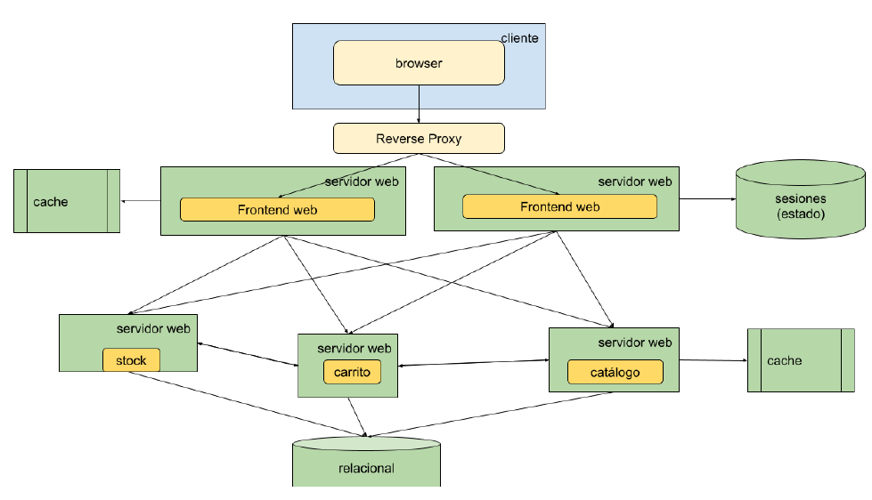
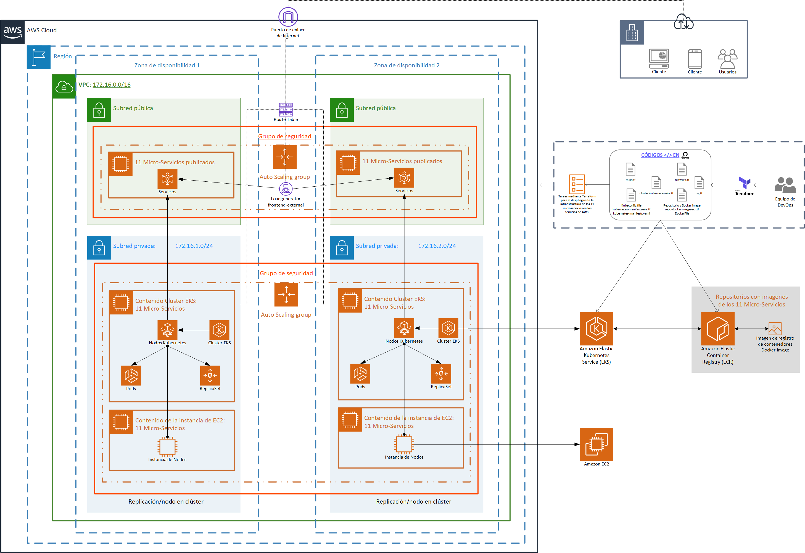

## Obligatorio Implementación de soluciones Cloud
 **Quinto semestre 2023**
 
 - Laura Carolina Scappa Baz N.º 270452 
 - María Valentina Castro Pacheco N.º 244130

**Repositorio GitHub:** [https://github.com/lscappa/Obligatorio-ISC](https://github.com/lscappa/Obligatorio-ISC)

# Online Boutique

**Online Boutique** es una aplicación de demostración de microservicios nativa de la nube. Online Boutique consta de una aplicación de microservicios de 10 niveles. La aplicación es una aplicación de comercio electrónico basada en la web donde los usuarios pueden buscar artículos, agregarlos al carrito y comprarlos.

## Screenshots

| Home Page                                                                                                         | Checkout Screen                                                                                                    |
| ----------------------------------------------------------------------------------------------------------------- | ------------------------------------------------------------------------------------------------------------------ |
|  |  |

# Presentación del problema
La startup “e-shop Services” ha recibido una ronda de inversión para expandir sus operaciones por todo el mundo, haciendo llegar sus servicios de e-commerce y retail, a todo el continente de América.
La competencia actualmente está posicionada en la región a la cual se quiere expandir, pero los inversionistas están presionando para que “e-shop Services” expanda su marca ya que de esto depende el seguir invirtiendo.
Se ha contratado a la consultora BitBeat para modernizar y desplegar la arquitectura e infraestructura de su aplicación que actualmente corre en un datacenter on-premise.
Una célula de desarrollo trabajó en la implementación del e-commerce basado en una arquitectura de microservicios para correr sobre containers cuyo ciclo de integración continua ya se encuentra configurado y la solución ya se encuentra disponible para desplegar por parte del equipo de DevOps.

## Arquitectura anterior (Legacy)

## Descripción de la Arquitectura migrada
- Un RP para publicar la aplicación
- Dos servidores Web para el Frontend
- Un Servidor web para el control de stock
- Un servidor web para el carrito de compras
- Un servidor web para el catálogo
- Una base de datos relacional
- Un servidor donde se almacenan documentos estáticos
- Una base de datos clave-valor
- Servicios de Cache

## Detalles de la implementación

### Arquitectura a desplegar en Cloud (Micro-servicios)

**Online Boutique** está compuesto por 11 microservicios escritos en diferentes idiomas que se comunican entre sí a través de gRPC. 

### Diagrama de arquitectura completo

### Descripción de los servicios

| Servicio                                              | Lenguaje      | Descripción                                                                                                                       |
| ---------------------------------------------------- | ------------- | --------------------------------------------------------------------------------------------------------------------------------- |
| [frontend](./Modules/frontend)                           | Go            | Expone un servidor HTTP para servir el sitio web. No requiere registro/inicio de sesión y genera ID de sesión para todos los usuarios automáticamente. |
| [cartservice](./Modules/cartservice)                     | C#            | Almacena los artículos en el carrito de compras del usuario en Redis y los recupera.                                                           |
| [productcatalogservice](./Modules/productcatalogservice) | Go            | Proporcione la lista de productos de un archivo JSON y la capacidad de buscar productos y obtener productos individuales.                        |
| [currencyservice](./Modules/currencyservice)             | Node.js       | Convierte una cantidad de dinero a otra moneda. Utiliza valores reales obtenidos del Banco Central Europeo. Es el servicio QPS más alto. |
| [paymentservice](./Modules/paymentservice)               | Node.js       | Carga la información de la tarjeta de crédito dada (simulacro) con el monto dado y devuelve una identificación de transacciones.                                     |
| [shippingservice](./Modules/shippingservice)             | Go            | Brinda estimaciones de costos de envío basados ​​en el carrito de compras. Envía artículos a la dirección dada (simulacro)                                 |
| [emailservice](./Modules/emailservice)                   | Python        | Envía a los usuarios un correo electrónico de confirmación del pedido (simulacro).                                                                                   |
| [checkoutservice](./Modules/checkoutservice)             | Go            | Recupera el carrito del usuario, prepara el pedido y organiza el pago, el envío y la notificación por correo electrónico.                            |
| [recommendationservice](./Modules/recommendationservice) | Python        | Recomienda otros productos según lo que se proporcione en el carrito.                                                                      |
| [adservice](./Modules/adservice)                         | Java          | Proporciones de anuncios de texto basados ​​en palabras de contexto dadas.                                                                                   |
| [loadgenerator](./Modules/loadgenerator)                 | Python/Locust | Envía solicitudes continuamente que imitan flujos de compras de usuarios realistas a la interfaz.                                              |

### Requisitos previos
- Cuenta de AWS
- Instalación [AWS Cli](https://docs.aws.amazon.com/es_es/cli/latest/userguide/getting-started-install.html), [Terraform](https://developer.hashicorp.com/terraform/tutorials/aws-get-started/install-cli), [Docker](https://docs.docker.com/get-docker/), [Kubectl](https://kubernetes.io/docs/tasks/tools/).
- [Configuración](https://docs.aws.amazon.com/cli/latest/userguide/cli-chap-configure.html) de las credenciles de AWS Cli en (`"~/.aws/credentials"`).

      [default]
      aws_access_key_id = <KEY>
      aws_secret_access_key = <SECRET>
      region = <REGION>

### Datos de la infraestructura 

Se realiza mediante Terraform el despliegue de la infraestructura de microservicios en los servicios de AWS.

1. Configuración de AWS VPC, subnet, gateway y route table:
   - Se crea un VPC (`aws_vpc.services-vpc`) con un bloque CIDR (`cidr_block`) y se habilita el soporte DNS y los nombres de host DNS.
   - Se crean dos subredes privadas (`aws_subnet.services-private-subnet` y `aws_subnet.services-private-subnet-2`) asociadas al VPC en diferentes zonas de disponibilidad, con bloques CIDR específicos (`cidr_block`).
   - Se crea un Internet Gateway (`aws_internet_gateway.services-gw`) y se asocia al VPC.
   - Se configura una tabla de enrutamiento por defecto (`aws_default_route_table.services-route-table`) que tiene una ruta hacia el Internet Gateway.
   - Código: [network](network.tf).

2. Configuración de AWS Security Group:
   - Se crea un grupo de seguridad (`aws_security_group.services-sg`) asociado al VPC.
   - Se definen reglas de entrada y salida en el grupo de seguridad para permitir el tráfico entrante en los puertos 22 (SSH) y 80 (HTTP) desde cualquier origen (`cidr_blocks`).
   - Se permite todo el tráfico de salida.
   - Código: [security-groups](security-groups.tf).

3. Configuración general
   - Se crean módulos, en los cuales cada uno representa un microservicio que es llamadado desde el archivo [main](main.tf) principal con los recursos necesarios para su configuraciones y despliegue.
   - Parametrización de los valores utilizados en la configuración generales o especificas para cada módulo mediante el uso de [variables de entrada](variables.tf), [variables de salida](output.tf) y [consultas](data.tf).

4. Configuración del repositorio de imágenes en AWS ECR:
   - Se crea un repositorio de imágenes en AWS ECR (`aws_ecr_repository.ecr_repo`) para cada microservicio, con su respectivo nombre.
   - Se establece una conexión con AWS ECR mediante la autenticación (`null_resource.docker_login_aws`).
   - Se crea una imagen de Docker para cada microservicio utilizando un Dockerfile (`docker_image.image_microservicio`), con su respectivo nombre.
   - Se etiqueta cada imagen de Docker y se sube con el recurso (`docker_registry_image.subir_image_microservicio`) al repositorio de Amazon ECR previamente creado.
   - Código de microservicio emailservice como ejemplo: [emailservice--repo-docker-image-ecr.tf](./Modules/emailservice/repo-docker-image-ecr.tf), [emailservice--Dockerfile](./Modules/emailservice/Dockerfile). 

5. Configuración del clúster EKS y el grupo de nodos:
   - Se crea un clúster EKS (`aws_eks_cluster.eks-cluster`).
   - Se especifica el rol de IAM del clúster y se configura la red del clúster con las subredes y el grupo de seguridad previamente creados.
   - Se crea un grupo de nodos (`aws_eks_node_group.node_group_services`) asociado al clúster EKS.
   - Se especifica el nombre del clúster y el nombre del grupo de nodos, y se configura la red del grupo de nodos con las subredes previamente creadas.
   - Se especifican los tipos de instancias, el tipo de capacidad y las configuraciones de escalado automático.
   - Se actualiza el archivo local para update-kubeconfig (`null_resource.update_kubeconfig_aws`) con el nombre del clusterpara actualizar la conexión local para permitir la comunicación con el clúster de EKS y aplicación de los manifiestos de Kubernetes al clúster creado en AWS EKS para la creación de los recursos definidos para los microservicios.
   - Código: [eks-cluster](eks.tf).

6. Aplicación de los manifiestos de Kubernetes al clúster EKS:
   - Se pasa a los manifiestos (`kubectl_path_documents.kubernetes-manifests`) la url con la imagen de Docker en el repositorio de Amazon ECR previamente creado.
   - Se ejecuta con kubectl el recurso (`kubectl_manifest.aplicar_kubernetes_manifests`) para aplicar los manifiestos al clúster EKS. 
   - Código de microservicio emailservice como ejemplo: [emailservice--kubernetes-manifests-eks.tf](./Modules/emailservice/kubernetes-manifests-eks.tf), [emailservice--deployment-kubernetes-manifests-replicaset.yaml](./Modules/emailservice/deployment/kubernetes-manifests-replicaset.yaml), [emailservice--deployment-kubernetes-manifests-service.yaml](./Modules/emailservice/deployment/kubernetes-manifests-service.yaml).

7. Terraform
   - Se utiliza Terraform, una herramienta de infraestructura como código (IaC), para definir y administrar la infraestructura en AWS y la configuración de Kubernetes en AWS EKS. Describiendo la infraestructura y los recursos deseados en archivos de configuración. 
   
   - **Aplicación del despliegue con Terraform:**

    1. Ejecutar comando `terraform init`: Este comando inicializa el directorio de trabajo de Terraform. Descarga los proveedores [provider](provider.tf) requeridos (AWS, Docker, Kubectl y Null) y configura el entorno de ejecución.
    2. Ejecutar comando `terraform plan`: Este comando muestra una planificación de los cambios que Terraform aplicará en la infraestructura de AWS. Proporciona una visión general de los recursos que se crearán, actualizarán o eliminarán.
    3. Ejecutar comando `terraform apply`: Este comando aplica los cambios planificados en la infraestructura de AWS. Terraform creará, actualizará o eliminará los recursos según lo definido en los archivos de configuración. Se deberá confirmar -`yes`- los cambios o `terraform apply -auto-approve`.
    4. Destruir la infraestructura creada en AWS, ejecutando el comando `terraform destroy`. Este comando eliminará todos los recursos administrados por Terraform de acuerdo con la configuración definida.

### Video con demostración del despliegue

https://github.com/lscappa/Obligatorio-ISC/assets/109998944/4f689ac3-45dd-430c-a7a0-1fdf4c3d4c38

https://github.com/lscappa/Obligatorio-ISC/assets/109998944/3e0f9e98-28e4-412b-9596-3d56c3c9ea3d

[Ver video en velocidad normal](https://fi365-my.sharepoint.com/:v:/g/personal/mc244130_fi365_ort_edu_uy/ES47dpF3fTZAhDVxukGI8fsB8fkUH9Mf47w_Rfdsn40A9A?e=rf6ieQ)

### Servicios de AWS Ejecutando

https://github.com/lscappa/Obligatorio-ISC/assets/109998944/7014e37c-4905-4319-b2ae-b97b49d933d9

[Ver video en velocidad normal](https://fi365-my.sharepoint.com/:v:/g/personal/mc244130_fi365_ort_edu_uy/Ec6pFEnjTOROgxBIVvTI4AUBDCtYYPnIthCOpIS9285PYw?e=hfSebG)

### Servicios de AWS usados
1. Amazon Elastic Compute Cloud (AWS EC2)
1. Amazon Virtual Private Cloud (AWS VPC)
1. Amazon Elastic Container Registry (AWS ECR)
1. Amazon Elastic Kubernetes Service (AWS EKS)

## Referencias
- Material de Aulas - Implementación de soluciones cloud
- [Info AWS](https://aws.amazon.com/es/)
- [Doc AWS](https://docs.aws.amazon.com/)
- [Doc Amazon Elastic Compute Cloud](https://docs.aws.amazon.com/ec2/?icmpid=docs_homepage_featuredsvcs)
- [Doc Amazon Virtual Private Cloud](https://docs.aws.amazon.com/vpc/?icmpid=docs_homepage_featuredsvcs)
- [Doc Amazon Elastic Container Registry](https://docs.aws.amazon.com/ecr/?icmpid=docs_homepage_containers)
- [Doc Amazon Elastic Kubernetes Service](https://docs.aws.amazon.com/eks/?icmpid=docs_homepage_containers)
- [Terraform EKS](https://tf-eks-workshop.workshop.aws/)
- [Info Terraform](https://registry.terraform.io/)
- [Terraform AWS Provider](https://registry.terraform.io/providers/hashicorp/aws/latest/docs)
- [Terraform AWS](https://developer.hashicorp.com/terraform/tutorials/aws-get-started)
- [Terraform Docker](https://registry.terraform.io/providers/kreuzwerker/docker/latest/docs)
- [Terraform Kubectl ](https://registry.terraform.io/providers/gavinbunney/kubectl/latest/docs)
- [Terraform Null](https://registry.terraform.io/providers/hashicorp/null/latest/docs)
- [Terraform Local Module](https://developer.hashicorp.com/terraform/tutorials/modules/module-create)
